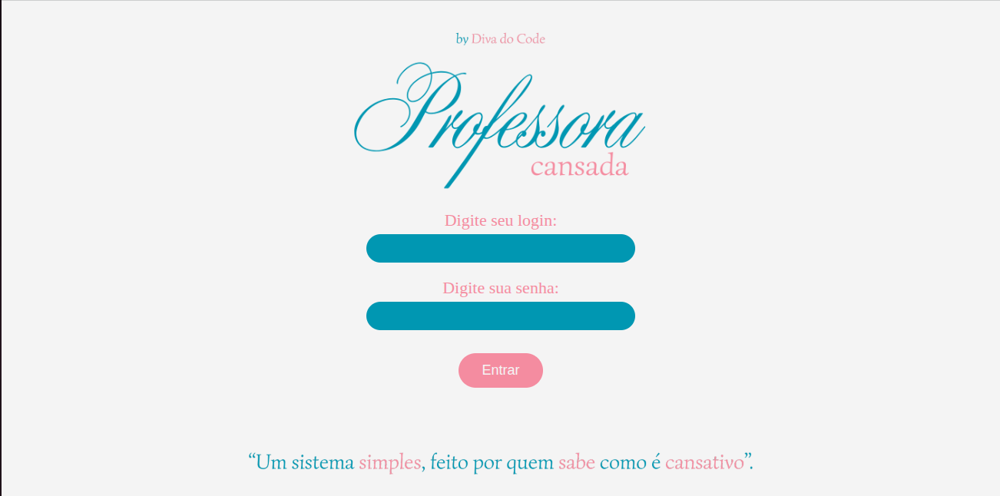
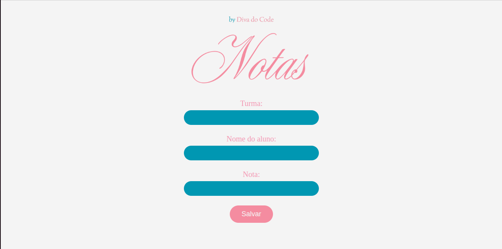
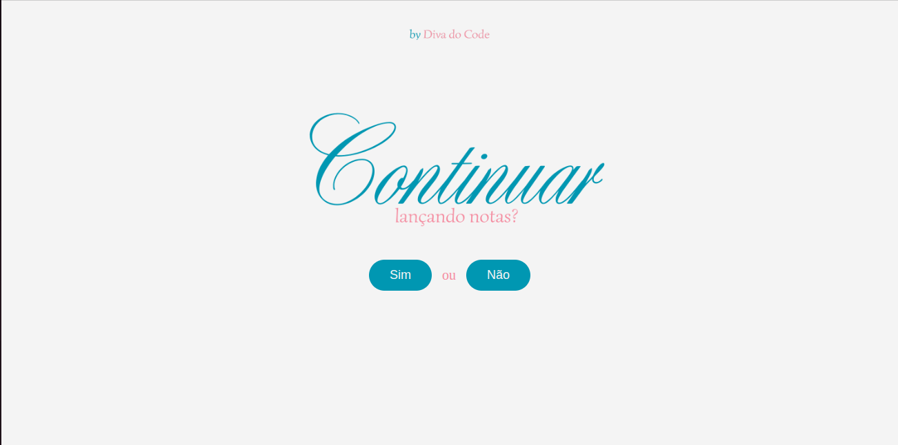

## Professora Cansada – Lançamento de Notas Simples

---

Aplicação web criada para ajudar professores a lançar notas de forma rápida, simples e sem complicação.
Interface direta, lógica clara e funcionamento suave mesmo no modo dry run (simulação segura).

O objetivo é mostrar como um sistema pensado para pessoas leigas pode ser organizado, seguro e intuitivo.

---

### Funcionalidades:

Tela inicial apresentando o sistema

Login com senha armazenada em hash

Lançamento de notas

Loop perguntando se o usuário quer lançar outra nota

Página final de agradecimento

Modo dry run simulando o envio das informações

Interface limpa feita em HTML + CSS

Backend em Flask

---

## Demonstração do Projeto

### Tela de Abertura


### Tela de Login



### Página de Notas



### Tela Principal (Loop)



### Tela de Agradecimento


---

### Como Rodar o Projeto

Quer testar o projeto localmente?
Abra o terminal na pasta do projeto e execute:

```bash
python app.py
```

Depois, abra no navegador:

http://localhost:5000

Pronto. Simples e direto.

---

### Tecnologias Utilizadas

Python (Flask)

HTML & CSS

Scripts internos em dry run (simulação)

---

### Para que serve esse projeto?

Esse projeto mostra como é possível transformar tarefas repetitivas em algo simples e amigável, pensado especialmente para:

Professores(as) cansados(as)

Usuários leigos

Pessoas que querem um sistema intuitivo

Portfólio de desenvolvedora fullstack
